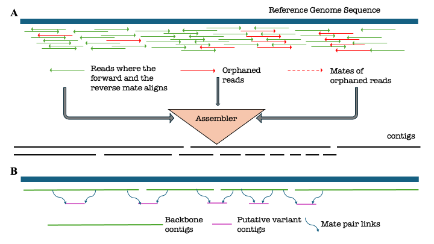

# Hot Springs Analysis
In this repository we maintain all the workflows to peform a reference reliant assembly and scaffolding of the hotspring metagenomes. The overall workflow can be summarized using this schematic diagram.

<p align="center"> </p>


1. ```Snakefile.Reassemble_Reads.smk```- Snakemake workflow to perform reference reliant assembly and scaffolding of the hotspring metagenomes. The config files associated with the workflow is available in the ```Scripts/Synechococcus_Paper/configs/config.json```
2. ```Snakefile.Cluster.smk```- Snakemake workflow to cluster the putative-variants identified by the previous step and annotates the variants using EggNOG. The config files associated with the workflow is available in the ```Scripts/Synechococcus_Paper/configs/config_cluster.json```
3. ```Snakefile.Summarize.smk```- Snakemake workflow to summarize the results from the previous steps and produces data files required for generating our figures/plots. The config files associated with the workflow is available in the ```Scripts/Synechococcus_Paper/configs/config_summarize.json```

This is a work in progress and reach out to hsmurali@umd.edu in case of any questions. 
